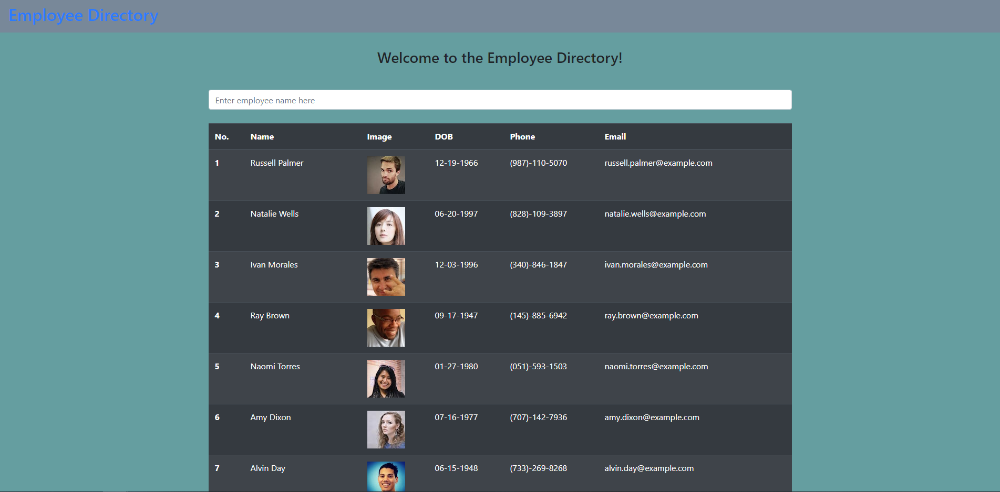
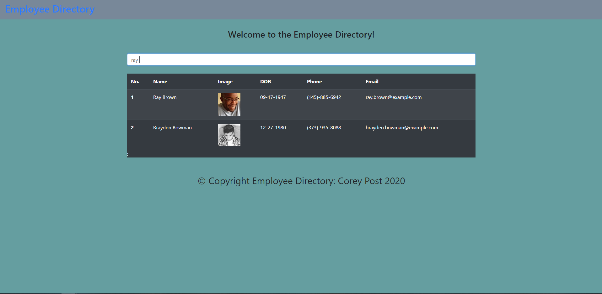

# Employee-Directory

# Description

An application that shows employees and their basic information and has a search feature to refine search for certain employees.

# Table of Contents

* [Process](#Process)
* [Issues](#Issues)
* [Link](#Link)
* [Screenshot](#Screenshot)

# Process

First clone project to computer.

Next, run mpi to get all packages needed installed.

Next run npm start and wait for the packages and codes to start react server.

Will see at the main screen the employee list directory.

Finally in search results type in employee name to refine search further.

# Issues

Learning react has been a fun challenge understanding exactly how to breackdown how the site works.

Very tidious creating css file for each component and changing in detail instead having one big css file.

creating the code for the table in the search results and index.js in the pages folder was a challenge.

getting all information to appear correctly from the API and alot of typos for the state.

# Link

[Link to Website](https://eelektrick.github.io/Employee-Directory/)

# Screenshot

